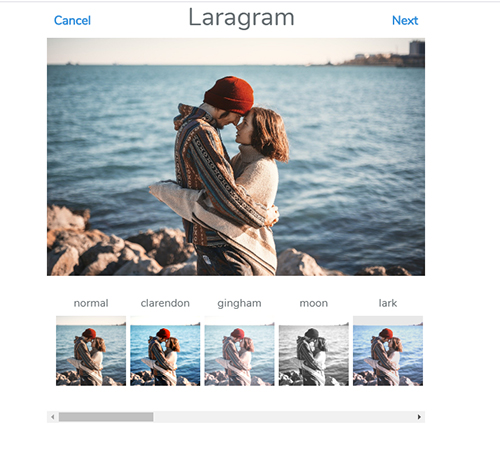
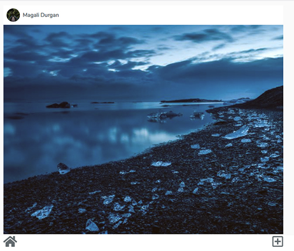

## Laragram

### This is the frontend for Laragram

This open source project was made with:

* Vue
* Vue router
* Tailwind
* Vuex
* Jest




## Installation

### Prerequisites

* To run this project, you must have the latest version of nodejs


### Step 1

 Begin by cloning this repository to your machine, and installing all Composer & NPM dependencies.

```bash
git clone https://github.com/lupanvi/laragram-vue-tailwind-frontend.git
npm install
```

### Step 2

Next, boot up a server and visit your laragram frontend app. 

```bash
npm run serve
```

1. Visit: `http://localhost:8080` and write the demo credentials:
	user: demo@gmail.com , password: 123456 , and press the login button
2. You will be redirected to the home page, where you can see and add pictures with filters
